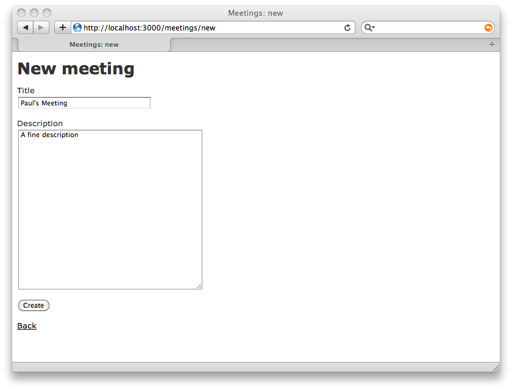
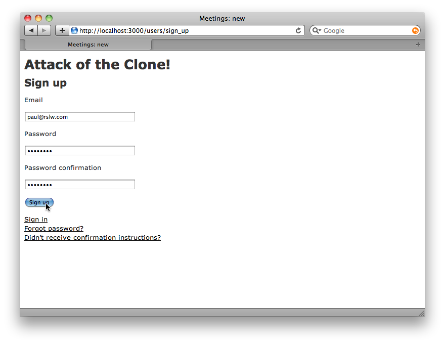

!SLIDE commandline

    gem install rails
    
!SLIDE commandline

    gem install rails
    Successfully installed rails-2.3.5
    1 gem installed
    

!SLIDE commandline
    rails ketchup-clone

!SLIDE commandline
    rails ketchup-clone
        create
        create  app/controllers
        create  app/helpers
        create  app/models
        create  app/views/layouts
        create  config/environments
        create  config/initializers
        create  config/locales
        create  config/environments
        create  config/initializers
        create  config/locales
        create  db
        create  doc
        create  lib
        create  lib/tasks
        create  log
        ...
    
!SLIDE commandline
    rails ketchup-clone
        ...
        create  public/images
        create  public/javascripts
        create  public/stylesheets
        create  script/performance
        create  test/fixtures
        create  test/functional
        create  test/integration
        create  test/performance
        create  test/unit
        create  vendor
        create  vendor/plugins
        create  tmp/sessions
        create  tmp/sockets
        create  tmp/cache
        create  tmp/pids
        create  Rakefile
        create  README
        ...
    
!SLIDE commandline
    rails ketchup-clone
        ...
        create  app/controllers/application_controller.rb
        create  app/helpers/application_helper.rb
        create  config/database.yml
        create  config/routes.rb
        create  config/locales/en.yml
        create  db/seeds.rb
        create  config/initializers/backtrace_silencers.rb
        create  config/initializers/inflections.rb
        create  config/initializers/mime_types.rb
        create  config/initializers/new_rails_defaults.rb
        create  config/initializers/session_store.rb
        create  config/environment.rb
        create  config/boot.rb
        create  config/environments/production.rb
        create  config/environments/development.rb
        create  config/environments/test.rb
        ...
    
!SLIDE commandline
    rails ketchup-clone
        ...
        create  script/about
        create  script/console
        create  script/dbconsole
        create  script/destroy
        create  script/generate
        create  script/runner
        create  script/server
        create  script/plugin
        create  script/performance/benchmarker
        create  script/performance/profiler
        create  test/test_helper.rb
        create  test/performance/browsing_test.rb
        ...
    
!SLIDE commandline
    rails ketchup-clone
        ...
        create  public/404.html
        create  public/422.html
        create  public/500.html
        create  public/index.html
        create  public/favicon.ico
        create  public/robots.txt
        create  public/images/rails.png
        create  public/javascripts/prototype.js
        create  public/javascripts/effects.js
        create  public/javascripts/dragdrop.js
        create  public/javascripts/controls.js
        create  public/javascripts/application.js
        create  doc/README_FOR_APP
        create  log/server.log
        create  log/production.log
        create  log/development.log
        create  log/test.log

!SLIDE
# Woohoo! !

!SLIDE commandline
    cd ketchup-clone
    ./script/generate scaffold meeting \
      title:string description:text
    
!SLIDE commandline smaller
    cd ketchup-clone
    ./script/generate scaffold meeting title:string description:text
        create  app/models/
        exists  app/controllers/
        exists  app/helpers/
        create  app/views/meetings
        create  app/views/layouts/
        create  test/functional/
        create  test/unit/
        create  test/unit/helpers/
        create  public/stylesheets/
        create  app/views/meetings/index.html.erb
        create  app/views/meetings/show.html.erb
        create  app/views/meetings/new.html.erb
        create  app/views/meetings/edit.html.erb
        create  app/views/layouts/meetings.html.erb
        create  public/stylesheets/scaffold.css
        create  app/controllers/meetings_controller.rb
        create  test/functional/meetings_controller_test.rb
        create  app/helpers/meetings_helper.rb
        create  test/unit/helpers/meetings_helper_test.rb
         route  map.resources :meetings
        dependency  model
        exists    app/models/
        exists    test/unit/
        create    test/fixtures/
        create    app/models/meeting.rb
        create    test/unit/meeting_test.rb
        create    test/fixtures/meetings.yml
        exists    db/migrate
        create    db/migrate/20100217150921_create_meetings.rb
    
!SLIDE small

    @@@ ruby
    # db/migrate/20100217150921_create_meetings.rb
    class CreateMeetings < ActiveRecord::Migration
      def self.up
        create_table :meetings do |t|
          t.string :title
          t.text :description

          t.timestamps
        end
      end

      def self.down
        drop_table :meetings
      end
    end

!SLIDE commandline

    rake db:migrate

!SLIDE commandline

    (in /Users/paul/Dropbox/Rushed Sunlight/presentations/UCD/ketchup-clone)
    ==  CreateMeetings: migrating =================================================
    -- create_table(:meetings)
       -> 0.0020s
    ==  CreateMeetings: migrated (0.0025s) ========================================

!SLIDE commandline

    ./script/server

!SLIDE commandline

    ./script/server
    => Booting Mongrel
    => Rails 2.3.5 application starting on http://0.0.0.0:3000
    => Call with -d to detach
    => Ctrl-C to shutdown server

!SLIDE center

!SLIDE commandline

    rm public/index.html

!SLIDE center

!SLIDE small
    @@@ruby
    # config/routes.rb
    ActionController::Routing::Routes.draw do |map|
      map.resources :meetings
    end
    
!SLIDE small
    @@@ruby
    # config/routes.rb
    ActionController::Routing::Routes.draw do |map|
      map.root :controller => :meetings, :action => :index
    
      map.resources :meetings
    end
    
!SLIDE center

!SLIDE center

!SLIDE center

!SLIDE center

!SLIDE center

!SLIDE commandline

    mv app/views/layouts/meetings.html.erb \
      app/views/layouts/application.html.erb
    
!SLIDE small
    @@@html
    # app/views/layouts/application.html.erb
    <!DOCTYPE html PUBLIC "-//W3C//DTD XHTML 1.0 Transitional//EN"
           "http://www.w3.org/TR/xhtml1/DTD/xhtml1-transitional.dtd">

    <html xmlns="http://www.w3.org/1999/xhtml" xml:lang="en" lang="en">
    <head>
      <meta http-equiv="content-type" content="text/html;charset=UTF-8" />
      <title>Meetings: <%= controller.action_name %></title>
      <%= stylesheet_link_tag 'scaffold' %>
    </head>
    <body>

    
<%= flash[:notice] %>

    <%= yield %>

    </body>
    </html>
    
!SLIDE small
    @@@html
    # app/views/layouts/application.html.erb
    <!DOCTYPE html PUBLIC "-//W3C//DTD XHTML 1.0 Transitional//EN"
           "http://www.w3.org/TR/xhtml1/DTD/xhtml1-transitional.dtd">

    <html xmlns="http://www.w3.org/1999/xhtml" xml:lang="en" lang="en">
    <head>
      <meta http-equiv="content-type" content="text/html;charset=UTF-8" />
      <title>Meetings: <%= controller.action_name %></title>
      <%= stylesheet_link_tag 'scaffold' %>
    </head>
    <body>
    
    <h1>Attack of the Clone!</h1>

    
<%= flash[:notice] %>

    <%= yield %>

    </body>
    </html>

!SLIDE center

!SLIDE commandline

    ./script/generate model item meeting_id:integer content:text

!SLIDE commandline

    ./script/generate model item meeting_id:integer content:text
          exists  app/models/
          exists  test/unit/
          exists  test/fixtures/
          create  app/models/item.rb
          create  test/unit/item_test.rb
          create  test/fixtures/items.yml
          exists  db/migrate
          create  db/migrate/20100217154014_create_items.rb

!SLIDE

    @@@ ruby
    # db/migrate/20100217154014_create_items.rb
    class CreateItems < ActiveRecord::Migration
      def self.up
        create_table :items do |t|
          t.integer :meeting_id
          t.text :content

          t.timestamps
        end
      end

      def self.down
        drop_table :items
      end
    end

!SLIDE commandline
    rake db:migrate

!SLIDE commandline
    rake db:migrate
    (in /Users/paul/Dropbox/Rushed Sunlight/presentations/UCD/ketchup-clone)
    ==  CreateItems: migrating ====================================================
    -- create_table(:items)
       -> 0.0015s
    ==  CreateItems: migrated (0.0018s) ===========================================

!SLIDE small
    @@@ html
    

      <b>Title:</b>
      <%=h @meeting.title %>
    

    

      <b>Description:</b>
      <%=h @meeting.description %>
    

    <%= link_to 'Edit', edit_meeting_path(@meeting) %> |
    <%= link_to 'Back', meetings_path %>
    
!SLIDE small
    @@@ html
    

      <b>Title:</b>
      <%=h @meeting.title %>
    

    

      <b>Description:</b>
      <%=h @meeting.description %>
    

    <ul>
    <%- @meeting.items.each do |item| -%>
      <li><%= item.content %></li>
    <%- end -%>
    </ul>

    <%= link_to 'Edit', edit_meeting_path(@meeting) %> |
    <%= link_to 'Back', meetings_path %>

!SLIDE
    @@@ ruby
    # app/models/meeting.rb
    class Meeting < ActiveRecord::Base
    end
    
!SLIDE
    @@@ ruby
    # app/models/meeting.rb
    class Meeting < ActiveRecord::Base
      has_many :items
    end

!SLIDE commandline
    ./script/console 
    Loading development environment (Rails 2.3.5)
    >>
    
!SLIDE commandline
    ./script/console 
    Loading development environment (Rails 2.3.5)
    >> Meeting.first.items.create(:content => "Here's an item")
    => #<Item id: 1,
        meeting_id: 1,
        content: "Here's an item", 
        created_at: "2010-02-17 15:46:12",
        updated_at: "2010-02-17 15:46:12">
        
!SLIDE center

!SLIDE center

!SLIDE
    @@@ ruby
    # app/models/meeting.rb
    class Meeting < ActiveRecord::Base
      has_many :items
    end

!SLIDE
    @@@ ruby
    # app/models/meeting.rb
    class Meeting < ActiveRecord::Base
      has_many :items
      
      accepts_nested_attributes_for :items
    end
    
!SLIDE smaller
    @@@ html
    # app/views/meetings.show.html.erb

    <ul>
    <%- @meeting.items.each do |item| -%>
      <li><%= item.content %></li>
    <%- end -%>
    </ul>

    <%= link_to 'Edit', edit_meeting_path(@meeting) %> |
    <%= link_to 'Back', meetings_path %>
    
!SLIDE smaller
    @@@ html
    # app/views/meetings.show.html.erb

    <ul>
    <%- @meeting.items.each do |item| -%>
      <li><%= item.content %></li>
    <%- end -%>
    </ul>

    <h3>Add Item</h3>
    <% form_for @meeting do |f| -%>
      <%= f.error_messages  -%>
      <fieldset>
        <%- @meeting.items.build -%>
        <%- f.fields_for :items do |item_form| -%>
          <%- if item_form.object.new_record? -%>
            <%= item_form.text_field :content %>
          <%- end -%>
        <%- end -%>
        <%= f.submit "Save" %>
      </fieldset>
    <% end -%>

    <%= link_to 'Edit', edit_meeting_path(@meeting) %> |
    <%= link_to 'Back', meetings_path %>
    
!SLIDE center

!SLIDE center

!SLIDE center

!SLIDE center

!SLIDE center

!SLIDE
# Authentication? #

!SLIDE
    @@@ ruby
    # config/environment.rb
    # Be sure to restart your server when you modify this file

    # Specifies gem version of Rails to use when vendor/rails is not present
    RAILS_GEM_VERSION = '2.3.5' unless defined? RAILS_GEM_VERSION

    # Bootstrap the Rails environment, frameworks, and default configuration
    require File.join(File.dirname(__FILE__), 'boot')

    Rails::Initializer.run do |config|
    end
    
!SLIDE
    @@@ ruby
    # config/environment.rb
    # Be sure to restart your server when you modify this file

    # Specifies gem version of Rails to use when vendor/rails is not present
    RAILS_GEM_VERSION = '2.3.5' unless defined? RAILS_GEM_VERSION

    # Bootstrap the Rails environment, frameworks, and default configuration
    require File.join(File.dirname(__FILE__), 'boot')

    Rails::Initializer.run do |config|
      config.gem 'devise'
    end

!SLIDE commandline

      gem install devise
      
!SLIDE commandline

      gem install devise
      Successfully installed devise-1.0.1
      1 gem installed

!SLIDE commandline
    ./script/generate devise_install
    
!SLIDE commandline smaller
    ./script/generate devise_install
          exists  config/initializers
          create  config/initializers/devise.rb
          exists  config/locales
          create  config/locales/devise.en.yml
          readme  README

    ===============================================================================

    Some setup you must do manually if you haven't yet:

      1. Setup default url options for your specific environment. Here is an
         example of development environment:

           config.action_mailer.default_url_options = { :host => 'localhost:3000' }

         This is a required Rails configuration. In production is must be the
         actual host of your application

      2. Ensure you have defined root_url to *something* in your config/routes.rb:

           map.root :controller => 'home'

    ===============================================================================
    
!SLIDE smaller
    @@@ ruby
    # config/environments/production.rb
    # Settings specified here will take precedence over those in config/environment.rb

    # In the development environment your application's code is reloaded on
    # every request.  This slows down response time but is perfect for development
    # since you don't have to restart the webserver when you make code changes.
    config.cache_classes = false

    # Log error messages when you accidentally call methods on nil.
    config.whiny_nils = true

    # Show full error reports and disable caching
    config.action_controller.consider_all_requests_local = true
    config.action_view.debug_rjs                         = true
    config.action_controller.perform_caching             = false

    # Don't care if the mailer can't send
    config.action_mailer.raise_delivery_errors = false
    
!SLIDE smaller
    @@@ ruby
    # config/environments/production.rb
    # Settings specified here will take precedence over those in config/environment.rb

    # In the development environment your application's code is reloaded on
    # every request.  This slows down response time but is perfect for development
    # since you don't have to restart the webserver when you make code changes.
    config.cache_classes = false

    # Log error messages when you accidentally call methods on nil.
    config.whiny_nils = true

    # Show full error reports and disable caching
    config.action_controller.consider_all_requests_local = true
    config.action_view.debug_rjs                         = true
    config.action_controller.perform_caching             = false

    # Don't care if the mailer can't send
    config.action_mailer.raise_delivery_errors = false
    
    config.action_mailer.default_url_options = { 
        :host => 'localhost:3000' 
      }

!SLIDE commandline
    ./script/generate devise User
    
!SLIDE commandline
    ./script/generate devise User
    exists  app/models/
    create  app/models/user.rb
    exists  db/migrate
    create  db/migrate/20100217160906_devise_create_users.rb
     route  map.devise_for :users
    
!SLIDE commandline
    rake db:migrate
   
!SLIDE commandline smalle
    rake db:migrate
    (in /Users/paul/Dropbox/Rushed Sunlight/presentations/UCD/ketchup-clone)
    ==  DeviseCreateUsers: migrating ==============================================
    -- create_table(:users)
       -> 0.0645s
    -- add_index(:users, :email, {:unique=>true})
       -> 0.0614s
    -- add_index(:users, :confirmation_token, {:unique=>true})
       -> 0.0005s
    -- add_index(:users, :reset_password_token, {:unique=>true})
       -> 0.0004s
    ==  DeviseCreateUsers: migrated (0.1307s) ====================================
    
!SLIDE commandline
    rake routes
    
!SLIDE commandline smaller
    rake routes
    (in /Users/paul/Dropbox/Rushed Sunlight/presentations/UCD/ketchup-clone)
          new_user_session GET    /users/sign_in                    {:action=>"new", :controller=>"sessions"}
              user_session POST   /users/sign_in                    {:action=>"create", :controller=>"sessions"}
      destroy_user_session GET    /users/sign_out                   {:action=>"destroy", :controller=>"sessions"}
         new_user_password GET    /users/password/new(.:format)     {:action=>"new", :controller=>"passwords"}
        edit_user_password GET    /users/password/edit(.:format)    {:action=>"edit", :controller=>"passwords"}
             user_password PUT    /users/password(.:format)         {:action=>"update", :controller=>"passwords"}
                           POST   /users/password(.:format)         {:action=>"create", :controller=>"passwords"}
     new_user_registration GET    /users/sign_up(.:format)          {:action=>"new", :controller=>"registrations"}
    edit_user_registration GET    /users/edit(.:format)             {:action=>"edit", :controller=>"registrations"}
         user_registration PUT    /users(.:format)                  {:action=>"update", :controller=>"registrations"}
                           DELETE /users(.:format)                  {:action=>"destroy", :controller=>"registrations"}
                           POST   /users(.:format)                  {:action=>"create", :controller=>"registrations"}
     new_user_confirmation GET    /users/confirmation/new(.:format) {:action=>"new", :controller=>"confirmations"}
         user_confirmation GET    /users/confirmation(.:format)     {:action=>"show", :controller=>"confirmations"}
                           POST   /users/confirmation(.:format)     {:action=>"create", :controller=>"confirmations"}
                      root        /                                 {:action=>"index", :controller=>"meetings"}
                  meetings GET    /meetings(.:format)               {:action=>"index", :controller=>"meetings"}
                           POST   /meetings(.:format)               {:action=>"create", :controller=>"meetings"}
               new_meeting GET    /meetings/new(.:format)           {:action=>"new", :controller=>"meetings"}
              edit_meeting GET    /meetings/:id/edit(.:format)      {:action=>"edit", :controller=>"meetings"}
                   meeting GET    /meetings/:id(.:format)           {:action=>"show", :controller=>"meetings"}
                           PUT    /meetings/:id(.:format)           {:action=>"update", :controller=>"meetings"}
                           DELETE /meetings/:id(.:format)           {:action=>"destroy", :controller=>"meetings"}
                           
!SLIDE commandline
    ./script/server

!SLIDE center

!SLIDE center

!SLIDE center

!SLIDE center

!SLIDE code smaller
    Date: Wed, 17 Feb 2010 16:16:15 +0000
    From: please-change-me@config-initializers-devise.com
    To: paul@rslw.com
    Subject: Confirmation instructions
    Mime-Version: 1.0
    Content-Type: text/html; charset=utf-8

    Welcome paul@rslw.com!

    You can confirm your account through the link below:

    <a href="http://localhost:3000/users/confirmation?confirmation_token=inSQW2bYPPL2Nr8_fez4">Confirm my account</a>
    
!SLIDE center

!SLIDE small
    @@@ruby
    class MeetingsController < ApplicationController
      # GET /meetings
      # GET /meetings.xml
      def index
        @meetings = Meeting.all

        respond_to do |format|
          format.html # index.html.erb
          format.xml  { render :xml => @meetings }
        end
      end
    ...
    end

!SLIDE small
    @@@ ruby
    class MeetingsController < ApplicationController
      before_filter :authenticate_user!

      # GET /meetings
      # GET /meetings.xml
      def index
        @meetings = Meeting.all

        respond_to do |format|
          format.html # index.html.erb
          format.xml  { render :xml => @meetings }
        end
      end
    ...
    end

!SLIDE commandline
    curl http://localhost:3000/meetings.xml
    
!SLIDE commandline
    curl http://localhost:3000/meetings.xml
    You are being redirected to /users/sign_in?unauthenticated=true

!SLIDE smaller
    @@@ruby
    # app/models/user.rb
    class User < ActiveRecord::Base
      # Include default devise modules. Others available are:
      # :http_authenticatable, :token_authenticatable, :lockable, :timeoutable and :activatable
      devise :registerable, :authenticatable, :confirmable, 
             :recoverable, :rememberable, :trackable,
             :validatable

      # Setup accessible (or protected) attributes for your model
      attr_accessible :email, :password, :password_confirmation
    end
    
!SLIDE smaller
    @@@ruby
    # app/models/user.rb
    class User < ActiveRecord::Base
      # Include default devise modules. Others available are:
      # :http_authenticatable, :token_authenticatable, :lockable, :timeoutable and :activatable
      devise :registerable, :authenticatable, :confirmable, 
             :recoverable, :rememberable, :trackable,
             :validatable, :http_authenticatable

      # Setup accessible (or protected) attributes for your model
      attr_accessible :email, :password, :password_confirmation
    end
    
!SLIDE commandline small
    curl -u paul@rslw.com:xxxxxxxx http://localhost:3000/meetings.xml
    
!SLIDE commandline small
    curl -u paul@rslw.com:xxxxxxxx http://localhost:3000/meetings.xml
    <?xml version="1.0" encoding="UTF-8"?>
    <meetings type="array">
      <meeting>
        <created-at type="datetime">2010-02-17T15:33:24Z</created-at>
        <description>A fine description</description>
        <id type="integer">1</id>
        <title>Paul's Meeting</title>
        <updated-at type="datetime">2010-02-17T15:33:24Z</updated-at>
      </meeting>
    </meetings>