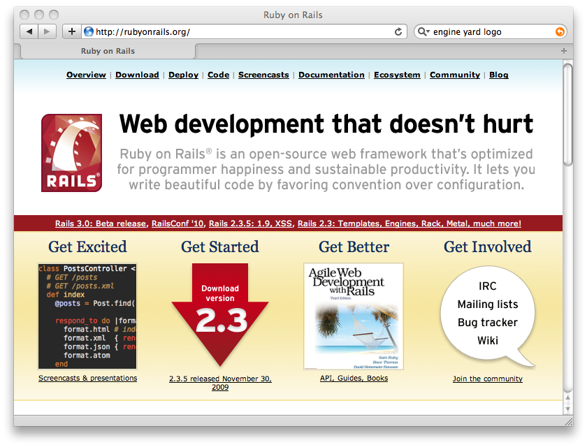
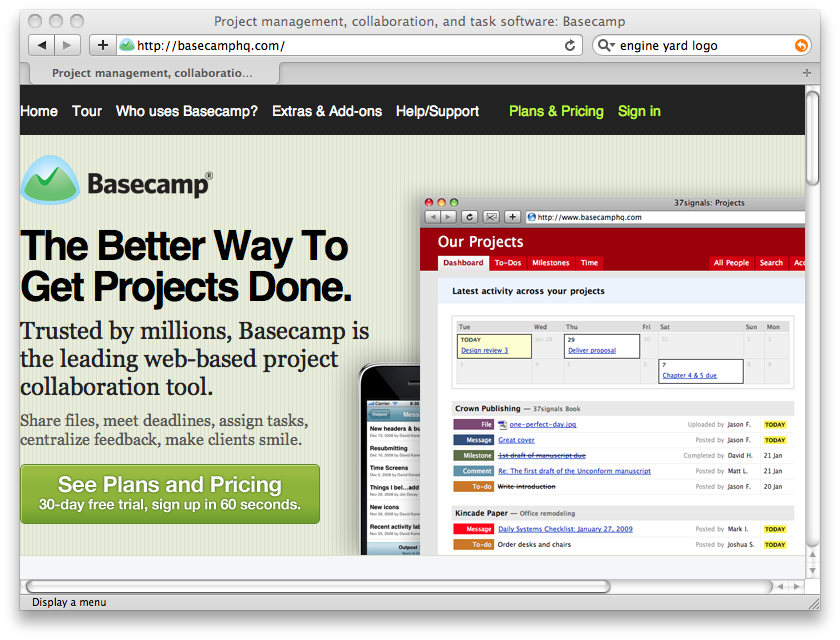

!SLIDE

# Rails #

!SLIDE

# Ruby on Rails #

!SLIDE center

!SLIDE

# Rails uses Ruby #

!SLIDE

# Since 2004 #

!SLIDE center

!SLIDE center

# Current Version 2.3.5 #

!SLIDE center

# Rails 3 just around the corner #

!SLIDE bullets incremental

# Buzzwords #
 - Opinionated Software
 - Convention Over Configuration
 - MVC
 - DRY
 - REST
 
!SLIDE bullets incremental
 
# Why Use Rails? #
- Productivity
- Maintainability
- Performance
- Ecosystem & Community
- Test Centred

!SLIDE bullets incremental smaller

# Lots of Parts #
- ActiveRecord
- ActionController
- ActionView
- ActiveSupport
- ActiveResource
- I18n
- Generators